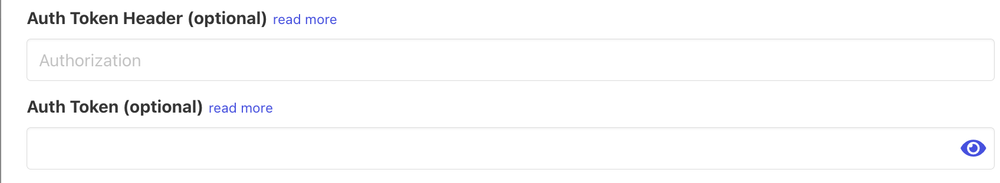
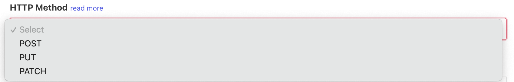

# Webhooks

## 🏃‍♀️ Getting Started

In this guide, we will show you how to connect webhooks to Census and create your first sync.

### Prerequisites

* Have your Census account ready. If you need one, [create a Free Trial Census account](https://app.getcensus.com/) now.
* Have an endpoint that accepts `POST` requests ready. You can use the free service [https://webhook.site](https://webhook.site/c9ce13dd-c04e-4b82-b861-1b2b51a56e40) for testing purposes. Please note that we use a HEAD request to test the Webhook connection so make sure you're able to accept this as well.
* Have the proper credentials to access to your data source. See our docs for each supported data source for further information:
  * [Azure Synapse](../sources/azure-synapse.md)
  * [Databricks](https://docs.getcensus.com/sources/databricks)
  * [Elasticsearch](https://docs.getcensus.com/sources/elasticsearch)
  * [Google BigQuery](https://docs.getcensus.com/sources/google-bigquery)
  * [Google Sheets](https://docs.getcensus.com/sources/google-sheets)
  * [MySQL](https://docs.getcensus.com/sources/mysql)
  * [Postgres](https://docs.getcensus.com/sources/postgres)
  * [Redshift](https://docs.getcensus.com/sources/redshift)
  * [Rockset](https://docs.getcensus.com/sources/rockset)
  * [Snowflake](https://docs.getcensus.com/sources/snowflake)
  * [SQL Server](https://docs.getcensus.com/sources/sql-server)

### 1. Create a Webhook Destination in Census

* Once you are in Census, navigate to [Destinations](https://app.getcensus.com/destinations)
* Click the **New Destination** button
* Select **Webhook** in the dropdown list
* Name your Destination (for example, `webhooksite test`) and Input the URL of your endpoint 👇
* Select whether syncs to this connection use Bulk Upload or not. For more see [#webhook-schema](webhook.md#webhook-schema "mention")
* Optionally add an authorization token. See [#authorization](webhook.md#authorization "mention")
* Optionally customize the rate limit. See [#sync-speed](webhook.md#sync-speed "mention")

<figure><figcaption><p>Webhook Connection Modal</p></figcaption></figure>


Your webhook destination will automatically be tested as we send a`HEAD`request and waiting for a`200 OK`to confirm it works. If the `HEAD` request is unsuccessful we will follow up with a single `POST` request with an empty body to test the connection.



Because we fallback to a `POST` request if the `HEAD` fails during connection testing you should account for this empty request body and perform validation so that you do not create extra, empty resources on your end.


### 2. Connect your Data Warehouse

Please follow one of our short guides depending on your data warehouse technology:

* [Redshift](https://help.getcensus.com/article/10-configuring-redshift-postgresql-access)
* [Postgres](https://help.getcensus.com/article/10-configuring-redshift-postgresql-access)
* [BigQuery](https://help.getcensus.com/article/21-configuring-bigquery-access)
* [Snowflake](https://help.getcensus.com/article/8-configuring-snowflake-access)

After setting up your warehouse, your Census Destinations page should look like this


### 3. Create your first Model

Now navigate to the [Model section of our Dashboard](https://app.getcensus.com/models)

Here you will have to write SQL queries to select the data you want to send to your Webhook Endpoint. Here are some ideas of data you can send:

* List of users that have their trial expired
* Accounts that have reached a specific Lead scoring
* list of users who haven't finished their product onboarding

Once you have created your model, click save.


### 4. Create your first Sync

Now head to the [Sync page](https://app.getcensus.com/syncs) and click the **Add Sync** button

In the " **What data do you want to sync?"** section

* For the **Connection**, select the data warehouse you connected in step 2
* For the **Source,** select the model you created in step 3

Next up is the **"Where do you want to sync data to?"** section

* Pick your Webhook destination (for us it is `Webhook Test`) as **the Connection**
* ⚠️ If you are familiar with Census, you will notice that there is no Object to select.

For the " **How should changes to the source be synced?"** section

* Select **Update or Create**
* Pick a **unique ID.** this is the key we will use to make sure we only sync new records or records with new values. We recommend using an internal id and if not, email/domain.

Finally, select the fields you want to update in the Mapper in the **"Which Fields should be updated?"** section

* By default, all of your table columns will be added to the mapper. If you don't want that, simply remove the columns/fields you don't want to sync in the mapper.

The end result should look something like this:



If you want, to can test the sync at the bottom which will sync one record to your destination


Click the **Next** button to see the final preview which will have a recap of what will happen when you start the sync

### 5. Confirm the data was sent to your Webhook Endpoint

Now go back to your destination or service, in our case we will go to [https://webhook.site](https://webhook.site/c9ce13dd-c04e-4b82-b861-1b2b51a56e40) and we should see a JSON payload will all of our data 🎉


That's it, in 5 steps, you connected Census to any endpoints or services by using webhooks 🎉

### Authorization

You can optionally provide a token to the Webhook connection and this will be sent along with every request. By default it is sent as an `Authorization` header but you can override the header name by specifying an `Auth Token Header`. Whatever you provide as the token will not be prefixed so the resulting header will look like `Authorization: <your token>`. If you wish to add a custom prefix like "Bearer" add it to the credential field manually. If no token is specified the header will not be added to the request.

<figure><figcaption><p>Auth token connection credential</p></figcaption></figure>

### 🏎 Sync Speed

Webhook destination speeds are subject to any rate limit enforced by the endpoint you are sending data to.

By default we rate limit outgoing requests to 30 requests/second. To override this you can provide a custom limit when editing the connection.

<figure><figcaption><p>Rate limit connection credential</p></figcaption></figure>

### :fax: HTTP Method

By default every Webhook connection will send `POST` requests but this behavior can be modified by choosing the desired method in the connection credentials modal. The allowed methods at this time are `POST`, `PUT`, and `PATCH`.

<figure><figcaption><p>Webhook method selection</p></figcaption></figure>

### 🗄 Webhook Schema

Each Webhook request contains both the data you mapped as well as metadata about the Census sync itself. If you want to just send the raw data object without any sync metadata then be sure to uncheck `Wrap Data Objects` in the connection credentials. When unchecked, requests will simply contain the fields you have mapped to without any sync metadata.

A request with data "wrapped" in metadata (default):

```json
{
  "api_version": 1,
  "operation": "changed",
  "sync_run_at": "2021-08-31T23:03:29Z",
  "connection_name": "Webhook Test",
  "model_name": "active users",
  "schema_name": null,
  "table_name": null,
  "sync_configuration_id": 1234,
  "sync_configuration_name": null,
  "data": [
  // This is an object representing the fields
  //  you mapped for that sync
    {
      "company": "Walsh and Sons",
      "company_domain": "adams.co.uk",
      "created_at": "2019-12-08 14:19:52",
      "unique_id": "isadora@safetymail.info",
      "first_name": "Alycia",
      "full_name": "Alycia Adams",
      "last_name": "Adams",
      "role": "International Mobility Assistant",
      "type": "free user",
      "user_id": "090ADD7A-6DBC-BE8A-CD45-459F4F7CA082",
      "website": "http://stehrweber.biz"
    },
    {
      ...
    },
    ...
  ]
}
```

vs an "unwrapped" data object:

```json
// Just the records you are sending
[
    {
      "company": "Walsh and Sons",
      "company_domain": "adams.co.uk",
      "created_at": "2019-12-08 14:19:52",
      "unique_id": "isadora@safetymail.info",
      "first_name": "Alycia",
      "full_name": "Alycia Adams",
      "last_name": "Adams",
      "role": "International Mobility Assistant",
      "type": "free user",
      "user_id": "090ADD7A-6DBC-BE8A-CD45-459F4F7CA082",
      "website": "http://stehrweber.biz"
    },
    {
      ...
    },
    ...
]
```


If you do not use bulk uploads the unwrapped object will be a Hash instead of an Array. See more below


### Bulk vs Single Record

Webhook connectors support bulk upload and individual upload. Which behavior we use is determined by what mode you select on the Webhook Connection. The default is to use bulk upload with a batch size of 1.

<figure><figcaption><p>Webhook Connector Bulk Upload Option</p></figcaption></figure>

With bulk upload, the `data` object is an array of records. The size of the array is determined by the `Batch Size` configuration set on the connection. The JSON schema of our bulk request is as follows:

```json
{
  "api_version": 1,
  "operation": "changed",
  "sync_run_at": "2021-08-31T23:03:29Z",
  "connection_name": "Webhook Test",
  "model_name": "active users",
  "schema_name": null,
  "table_name": null,
  "sync_configuration_id": 1234,
  "sync_configuration_name": null,
  "data": [
  // This is an object representing the fields
  //  you mapped for that sync
    {
      "company": "Walsh and Sons",
      "company_domain": "adams.co.uk",
      "created_at": "2019-12-08 14:19:52",
      "unique_id": "isadora@safetymail.info",
      "first_name": "Alycia",
      "full_name": "Alycia Adams",
      "last_name": "Adams",
      "role": "International Mobility Assistant",
      "type": "free user",
      "user_id": "090ADD7A-6DBC-BE8A-CD45-459F4F7CA082",
      "website": "http://stehrweber.biz"
    },
    {
      ...
    },
    ...
  ]
}
```

To send only one record in every request you should uncheck `Use Bulk Upload` on the connection. When not using bulk upload `Batch Size` is irrelevant. The JSON schema of a request without bulk upload is as follows:

<pre class="language-json"><code class="lang-json"><strong>{
</strong>  "api_version": 1,
  "operation": "changed",
  "sync_run_at": "2021-08-31T23:03:29Z",
  "connection_name": "Webhook Test",
  "model_name": "active users",
  "schema_name": null,
  "table_name": null,
  "sync_configuration_id": 1234,
  "sync_configuration_name": null,
  "data": {    // One object per request
      "company": "Walsh and Sons",
      "company_domain": "adams.co.uk",
      "created_at": "2019-12-08 14:19:52",
      "unique_id": "isadora@safetymail.info",
      "first_name": "Alycia",
      "full_name": "Alycia Adams",
      "last_name": "Adams",
      "role": "International Mobility Assistant",
      "type": "free user",
      "user_id": "090ADD7A-6DBC-BE8A-CD45-459F4F7CA082",
      "website": "http://stehrweber.biz"
   }
}
</code></pre>

## :wastebasket: Deleting Records

If you select `Mirror` for your operation then the sync will send records that have been deleted from the source. In the schema above the `operation` field will have value `deleted`

and by default the only field in the record will be `unique_id`. This is because most of the time you only need a unique record id to effectively delete a record in the destination. If you would instead like to send the entire record on deletes you can toggle the advanced configuration option in the sync settings page:

<figure><figcaption><p>Advanced configuration for sending full records in delete operations</p></figcaption></figure>

<figure><figcaption><p>Advanced configuration option on existing sync page</p></figcaption></figure>

**Default Delete Payload**

```
{
  api_version: 1,
  operation: 'deleted',
  sync_run_at: '...',
  connection_name: 'Webhook',
  model_name: ...,
  schema_name: '...',
  table_name: '...',
  sync_configuration_id: ...,
  sync_configuration_name: ...,
  data: { unique_id: '3' }
}
```

**Delete Payload w/ Full Record**

```
{
  api_version: 1,
  operation: 'deleted',
  sync_run_at: '...',
  connection_name: 'Webhook',
  model_name: ...,
  schema_name: '...',
  table_name: '...',
  sync_configuration_id: ...,
  sync_configuration_name: ...,
  data: {
    unique_id: '2',
    bfield: false,
    created_at: '...',
    email: '...',
    list: '...'
  }
}
```


## 🔄 Supported Sync Behaviors


Learn more about what all of our sync behaviors on our [Core Concept page](../basics/core-concept/#the-different-sync-behaviors).


|        **Behaviors** | **Supported?** | **Objects** |
| -------------------: | :------------: | :---------: |
| **Update or Create** |        ✅       |     All     |
|           **Append** |        ✅       |     All     |
|           **Mirror** |        ✅       |     All     |

[Contact us](mailto:support@getcensus.com) if you want Census to support more sync behaviors for webhooks.

## 🚑 Need help connecting to Webhooks?

[Contact us](mailto:support@getcensus.com) via support@getcensus.com or start a conversation with us via the [in-app](https://app.getcensus.com) chat.
