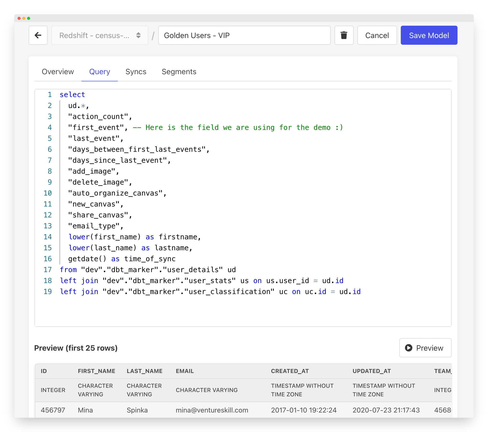

# Census Models

Census models require nothing other than a data source connection. Once you've got any data source connected (except Google Sheets, which sadly doesn't run SQL yet!), you can immediately start creating Census models.&#x20;

You can think of Census models as a fast way to write and reference a SQL query. You can write a brand new query or copy-and-paste one from an existing system. Give it a name and save it, and you can immediately start using your model as a source for any of your syncs.&#x20;

We like to think of Census models as a shortcut. It's meant to get you started with modeling quickly. But if you have a more complex set of models in mind, take a look at our dbt or Looker model sources.

