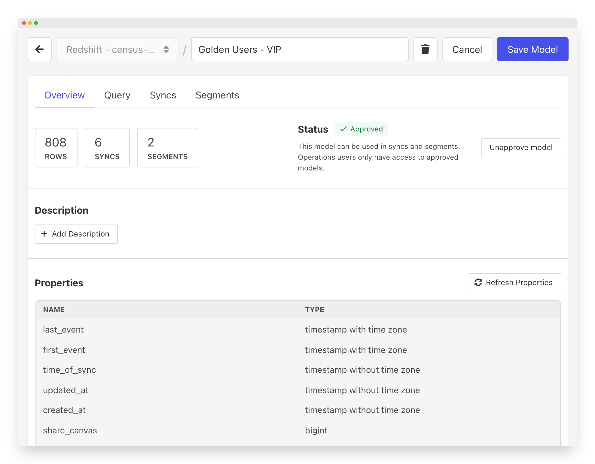

# Overview

At Census, we call individual data source sets "Models". Models usually represent a single type of "thing" like a person (or a lead or a contact) or a company (or an account or organization). They can also be other things like invoices, campaigns, events, or devices. A model is usually a list or a set of those things. It can be the full set of every person you know or it can be be a subset (often called a list or segment - read more about how Census helps you [create segments](../segments/getting-started.md) on your models).

A model is a table in a data warehouse that looks an awful lot like a spreadsheet. The rows are individual records of that model, and all rows have the same set of columns. Typically, if you look at the columns, you'll have one or two unique identifier columns, and then a bunch of details for each of the records, things like name, last event date, or number of actions they took. \

Models can come in a variety of forms:

* Tables or Views already in your data warehouse – This is the most common. If you've a data warehouse at your company, chances are, you've already built some tables that act as your models.
* Models built with data transform tools like [dbt](https://www.getdbt.com). – We're big fans of dbt here at Census. It's why we have a built in [dbt integration](native-dbt-integration.md). These tools make it easy to build and maintain sophisticated data transforms that keep your models up to date.
* SQL queries – Yes, even a SQL query can work as a model. It's a handy way to start when you're just getting going. Just plan to eventually evolve to data transform tools like dbt as you create more models!

The actual set of properties/columns your model have can be anything. The only important thing is that they're the properties that matter to you and your business. The benefit of building models is that you can define them one time, The Right Way™ and then use that as the authoritative source for all of your apps.

The following pages cover the various ways you can add or create models in Census.&#x20;
