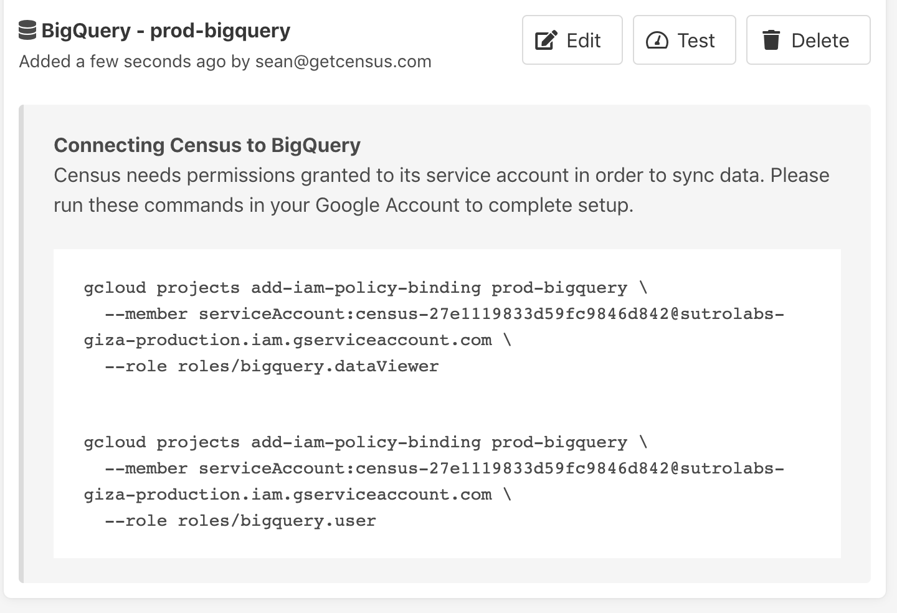

# Google BigQuery

## 📺 How-To Configure BigQuery Video



## 🔐 Required permissions


These instructions are well tested to connect Census to BigQuery. If you're running into connection issues or missing tables or views, please confirm you've run all of these instructions.


Census reads data from one or more tables \(possibly across different schemata\) in your data warehouse and publishes it to the corresponding objects in external systems, such as Salesforce. To limit the load on your database as well as external APIs, Census computes a “diff” to determine changes between each update. In order to compute these diffs, Census creates and writes to a number of tables in the  `census` dataset \('dataset' is what Google calls their equivalent of a 'schema' in standard database terminology\).In order for the Census connection to work correctly, the account you provide to Census must have these permissions:

* Permission to create a new `census` dataset or an existing `census` dataset, and full admin access to all schema/tables within that dataset \(including creating and deleting tables, and reading and writing to all tables\). 
* Read-only access to any tables and views in any schemata that you would like Census to publish to Salesforce.

BigQuery manages these permissions through their IAM Policy mechanism. Specifically, Census uses two BigQuery policies by default:

* `bigquery.dataViewer` - Allows Census read-only access to list the datasets and tables in the BigQuery instance, and to get data from the tables.
* `bigquery.user` - Allows Census to create new datasets which we use to create the `CENSUS` dataset. This then grants Census the `bigquery.dataOwner`  role on this dataset.

#### Advanced Permissions

We definitely recommend you use the two permissions we specify when creating a new BigQuery connection. If you cannot grant these permissions at the project level, you can grant them finer grain. These are the specific permissions the Census service account needs:

* `bigquery.dataViewer` access on the dataset or specific table you'd like Census to read from.
* You can manually create a `CENSUS` dataset. The Census service account will then need the `bigquery.dataOwner`  role on this dataset.
* Finally, Census service account needs project-level access with the `bigquery.JobUser` role or specifically the `bigquery.jobs.create` permission \(via a custom role\).

## 🔩 Configuring a new BigQuery connection

Because permissions are a bit unique on BigQuery so the process of creating a new connection to Census requires a few extra steps.

1. Visit the **Connections** section on Census, and press **Add Data Warehouse Connection**, selecting **BigQuery** from the list.
2. Census will ask you to provide the **Google Cloud Project ID** that contains your BigQuery instance. You can find that on the [Google Cloud Console](https://console.cloud.google.com/) in the **Project Info** section. If you have multiple Google Cloud projects, you'll need to first select the correct one with the project picker in the top right.  


   

3. Once you've provided Census with your Project ID, Census will automatically generate a new Role Account we'll use to communicate with your BigQuery and provide you with two copy and paste-able commands you can use to grant permissions for this account on this project. The easiest way to execute these commands is within the **Google Cloud Shell** in the Google Cloud Console.  


   

4. Once you've run both commands, press the **Test** button in Census. This will validate that you've granted the appropriate credentials. Once you've got a checkmark for all four steps, you're good to go!  


   

## **🗃**Accessing Google Sheets and Google Drive tables in BigQuery

BigQuery supports [External Tables](https://cloud.google.com/bigquery/external-data-drive) which allows Google Sheets and tabular data in Google Drive to appear as tables in BigQuery. In order for Census to access these resources, it must be given explicit access to the Google Sheet or Google Drive document.

1. First, you'll need the Census service account's email address for your specific connection. You can see that in the [Connections Tab](https://app.getcensus.com/connections). It's of the form census-\[LONG ID\]@sutrolabs-giza-production.iam.gserviceaccount.com
2. Next, in Google Drive, click Share and give that email address permission to View the contents of the document.

If Census does not have view access to the document, you will see an error indicating that Census does not have permission to access the underlying data for that table.

## **🗃**Accessing views that depend on other projects in BigQuery

It's possible to create views in a BigQuery project that reference the tables and views present in other BigQuery projects. In order for Census to access these types of views within your project, it must also be granted permissions in the other projects that contain the referenced tables and views. If you are using the default IAM policies that Census recommends, you may run the following commands in your **Google Cloud Shell** in the Google Cloud Console, where:

* **\[new-project\]** is the name of the project where the referenced tables and views exist.
* **\[service-account-user\]** is the Census service account's email address for the specific connection that contains the view you're trying to access. You can see that in the [Connections Tab](https://app.getcensus.com/connections). It's of the form census-\[LONG ID\]@sutrolabs-giza-production.iam.gserviceaccount.com

```text
gcloud projects add-iam-policy-binding [new-project] \
  --member serviceAccount:[service-account-user] \
  --role roles/bigquery.dataViewer
  
gcloud projects add-iam-policy-binding [new-project] \
  --member serviceAccount:[service-account-user] \
  --role roles/bigquery.user
```

Google BigQuery permissions are recursive. If the referenced view in the new project _also references_ tables and views in other projects, you may need to repeat the above steps for those other projects until Census has the ability to access the ultimate source of a given view.

## 🚦 Allowed IP Addresses

Census will always connect to your data warehouse from of these static IP addresses:

* 34.216.163.241
* 54.212.243.205

While BigQuery itself doesn't support IP allow lists, you can use [VPC Service Controls](https://cloud.google.com/vpc-service-controls/docs/overview) to wrap your BigQuery instance and limit access.  

