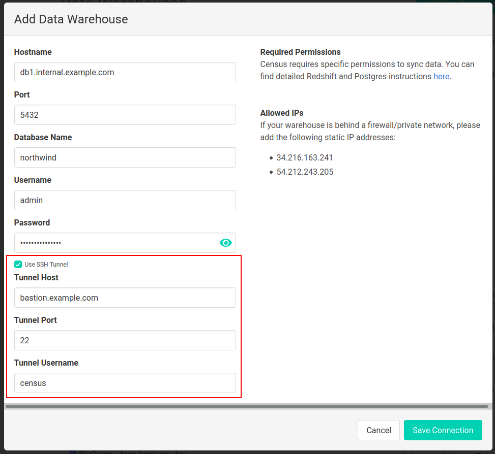
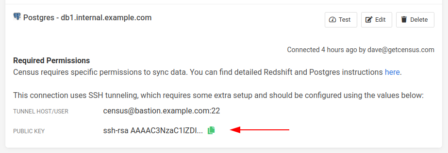

# Postgres

## 🔐 Required Permissions


These instructions are well tested to connect Census to Postgres. If you're running into connection issues or missing tables or views, please confirm you've run all of these instructions. 


Census reads data from one or more tables \(possibly across different schemata\) in your database and publishes it to the corresponding objects in external systems such as Salesforce. To limit the load on your database as well as to other apps' APIs, Census computes a “diff” to determine changes between each update. In order to compute these diffs, Census creates and writes to a set of tables to a private bookkeeping schema \(2 or 3 tables for each sync job configured\).

We recommend you create a dedicated `CENSUS` user account with a strong, unique password. Census uses this account to connect to your PostgreSQL database. In order for the Census connection to work correctly, the `CENSUS` account must have these permissions:

* The ability to create the `CENSUS` schema and full admin access to all tables within that schema \(including creating tables, deleting tables, and reading and writing to all tables\).
* Read-only access to any tables and views in any schemata that you would like Census to publish to your service destinations.
* If you are using Census to load service data into your warehouse, read-write access to the schema where Census should load data \(note that this is not included in the sample script below\).

PostgreSQL permissions are complex and there are many ways to configure access for Census. The script below has been tested with recent PostgreSQL versions and is known to work correctly:

```text
-- Give the census user the ability to sign in with a password
CREATE USER CENSUS WITH PASSWORD '<strong, unique password>';

-- Create a private bookkeeping schema where Census can store sync state
CREATE SCHEMA CENSUS;

-- Give the census user full access to the bookkeeping schema
GRANT ALL ON SCHEMA CENSUS TO CENSUS;

-- Ensure the census user has access to any objects that may have already existed in the bookkeeping schema
GRANT ALL PRIVILEGES ON ALL TABLES IN SCHEMA CENSUS TO CENSUS;

-- Let the census user see this schema
GRANT USAGE ON SCHEMA "<your schema>" TO CENSUS;

-- Let the census user read all existing tables in this schema
GRANT SELECT ON ALL TABLES IN SCHEMA "<your schema>" TO CENSUS;

-- Let the census user read any new tables added to this schema
ALTER DEFAULT PRIVILEGES IN SCHEMA "<your schema>" GRANT SELECT ON TABLES TO CENSUS;

-- Let the census user execute any existing functions in this schema
GRANT EXECUTE ON ALL FUNCTIONS IN SCHEMA "<your schema>" TO CENSUS;

-- Let the census user execute any new functions added to this schema
ALTER DEFAULT PRIVILEGES IN SCHEMA "<your schema>" GRANT EXECUTE ON FUNCTIONS TO CENSUS;
```

## 💡 Notes


We **strongly recommend against** connecting Census a production Postgres database. Census queries are often very analytical in nature and do not always play nicely with production environments. Unfortunately, Postgres doesn't give you much ability to control performance impacts across users so to avoid issues, please use Census with databases set up for analytic workloads only!


* If you have multiple schemata that you would like Census to read from, repeat the steps for "&lt;your schema&gt;" for each of them
* In older versions of PostgreSQL, if there are views in your schema that reference tables in other schemata, you will also need to give Census read access to those other schemata. In later versions of PostgreSQL this extra read access is not required.
* If you are using Census models to execute stored procedures \(this is rare and not recommended for most users\) you may also need to give Census access to those procedures

## 🔑 Encryption

All connections from the Census Data Warehouse Service to your database are protected by TLS encryption - Census will refuse to connect to a warehouse that does not support TLS. All Census data stored in S3 is encrypted with AWS Server-Side Encryption \(SSE\). We recommend configuring your PostgreSQL instance to use TLS v1.2 or later for all connections.

## 🚦Allowed IP Addresses

Census will always connect to your data warehouse from of these static IP addresses located within AWS:

* 34.216.163.241
* 54.212.243.205

With Postgres you'll need to add these IPs in your firewall, and/or add rules to your `pg_hba.conf` file to only allow the Census user to connect to your database when using these IP addresses.

## 🚇 Connecting via SSH tunnel

Census optionally allows connecting to Postgres warehouses that are only accessible on private/internal networks via SSH tunneling. To do so, you'll need to provide an SSH host server that is visible on the public internet and can connect to the private warehouse, and you'll also need to be able to perform some basic admin actions on that server.

1. Create a new user account for Census on the SSH host. \(This account is separate from the database user account and can have a different username.\)
2. On the Census connections page, create a new connection to a Postgres warehouse, enter the warehouse connection details, and then check the 'Use SSH Tunnel' option as shown below.  Fill in the host and port of the SSH host machine along with the name of the user created in the previous step.



3. Once the connection is created, Census will generate a keypair for SSH authentication which can be accessed from the connections page. 

To install the kepair, copy the public key in Census to you clipboard and add it to the SSH authorized keys file on the SSH host for the user created in the first step.  If, for example, this user is named `census`, the file should be located at`/home/census/.ssh/authorized_keys`. You may need to create this file if it doesn't exist.

Note that the keypair is unique for each Census Warehouse connection. Even if you're reusing the same credentials, you'll need to add the new public keys.



4. If the SSH host restricts IP ranges that can connect to it, add the Census IPs to the allow list.

With these steps complete, you should be able to complete a connection test, indicating that your tunneled connection is ready to be used in syncs.

