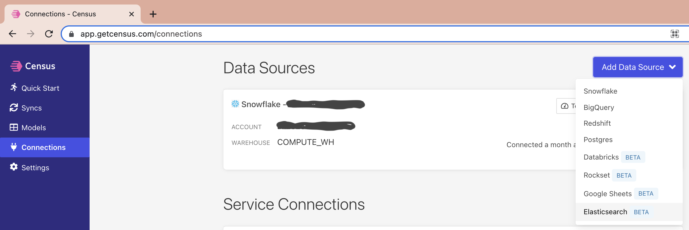

# Elasticsearch

Census lets you select an Elasticsearch instance to treat as a source for your syncs.

In order to sync data from Elasticsearch, Census needs your deployment url, port, username, and password. This walks you through the step by step of setting this up.

## Create an Elasticsearch connection

* In Census, go to **Sources** or click [here to go to the app](https://app.getcensus.com/sources).
* Click **New Source** and select **Elasticsearch**.

* Enter into your Elastic search instance. Click on the deployment name such that it takes you to a url that looks like `https://cloud.elastic.co/deployments/3last1ch3x4d3c1m4lstr1ng` click on the following button to copy your Elasticsearch endpoint string to your clipboard

* Copy and paste this in the "Server Hostname" field. Then take off the :1234 part at the end to paste those four digits in the "Server Port" field. The user and password are the same from logging into your elastic.co account. Click Save Connection.

You're all set! Click "test connection" and you can query this from the models tab and use it as a source for syncing data to our library of destinations.


If you have any questions during setup, or have a use case that is not covered, please write us in-app or contact the support team


## Notes

* We based our connection protocol on Elastic's [SQL JDBC driver](https://www.elastic.co/guide/en/elasticsearch/reference/current/sql-jdbc.html)

## Advanced Network Configuration

Census can successfully connect to Elasticsearch instances that are using advanced networking controls including region constraints and IP address allow lists. For more information, see our [regions-and-ip-addresses.md](../../misc/security-and-privacy/regions-and-ip-addresses.md "mention") documentation.

## Need help connecting to Elasticsearch?

Contact the support team or start a conversation with us via the [in-app](https://app.getcensus.com) chat.
