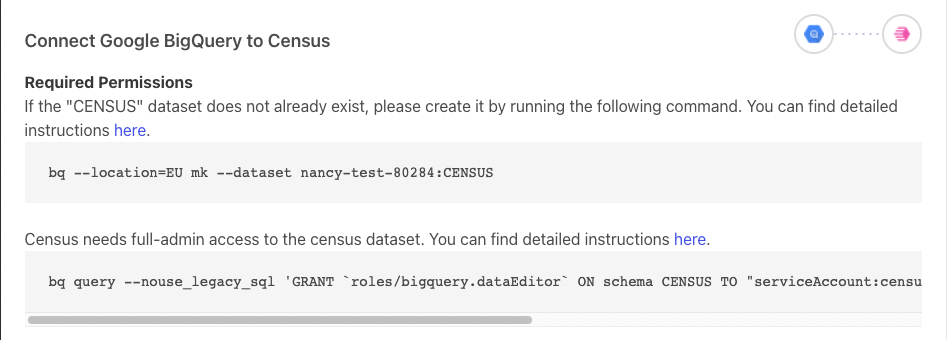

# Google BigQuery

## Required permissions


These instructions are well tested to connect Census to BigQuery. If you're running into connection issues or missing tables or views, please confirm you've run all of these instructions.


Census reads data from one or more tables (possibly across different schemata) in your data warehouse and publishes it to the corresponding objects in external systems, such as Salesforce. To limit the load on your database as well as external APIs, Census computes a “diff” to determine changes between each update. In order to compute in-warehouse diffs, Census creates and writes to a number of tables in the `CENSUS` dataset ('dataset' is what Google calls their equivalent of a 'schema' in standard database terminology).In order for the Census connection to work correctly, the account you provide to Census must have these permissions:

* Skip this step if working in read-only mode. Full admin access to all schema/tables within the `CENSUS` dataset (including creating and deleting tables, and reading and writing to all tables).
* Read-only access to any tables and views in any schemata that you would like Census to publish to destination applications. **Note**: Your BigQuery connection region will need to match the specific table region.
* Permissions to create jobs in order to unload data.

BigQuery manages these permissions through their IAM Policy mechanism. Specifically, Census uses three BigQuery policies by default:

* `bigquery.dataViewer` - Allows Census read-only access to list the datasets and tables in the BigQuery instance, and to get data from the tables.
* `bigquery.dataEditor` - Allows Census full-admin access to the tables in the `CENSUS` dataset. Skip this step if working in read-only mode.
* `bigquery.jobUser` - Allows Census to create jobs to unload data.

#### Advanced Permissions

We definitely recommend you use the three permissions we specify when creating a new BigQuery connection. If you cannot grant these permissions at the project level, you can grant them finer grain. These are the specific permissions the Census service account needs:

* `bigquery.dataViewer` access on the dataset or specific table you'd like Census to read from.
  * If you are granting the `bigquery.dataViewer` permission at a more granular level than the project level you should still grant the`bigquery.metadataViewer` permission at the project level ([Google Documentation](https://cloud.google.com/bigquery/docs/access-control#bigquery.metadataViewer)). This will enable Census to display your provisioned datasets within the UI for sync creation. Google requires permission to read metadata at the project level in order to list your datasets.
* `bigquery.dataEditor` access on the `CENSUS` dataset OR `bigquery.dataOwner` access on the `CENSUS` dataset if you would like to additionally grant Census permissions to delete the `CENSUS` dataset. Skip this step if working in read-only mode.
* Finally, Census service account needs project-level access with the `bigquery.JobUser` role or specifically the `bigquery.jobs.create` permission (via a custom role).

#### Providing a Service Account Key

You may also choose to create your own service account and provide Census with the service account key JSON file. This is useful if you want to manage the lifecycle of the service account yourself. If you choose to provide a service account key, the service account must be granted the same permissions described above.

If you also plan to use Census's dbt integration with BigQuery via a Service Account Key, you'll need to grant an additional role: `roles/iam.serviceAccountTokenCreator`. This permission is used by dbt to authenticate with BigQuery when compiling models. For more details, see [dbt's documentation](https://docs.getdbt.com/faqs/Warehouse/bq-impersonate-service-account-setup).

## Configuring a new BigQuery connection

Because permissions are a bit unique on BigQuery so the process of creating a new connection to Census requires a few extra steps.

1. Visit the **Sources** section on Census, and press **New Source**, selecting **BigQuery** from the list.
2.  Census will ask you to provide the **Google Cloud Project ID** that contains your BigQuery instance. You can find that on the [Google Cloud Console](https://console.cloud.google.com) in the **Project Info** section. If you have multiple Google Cloud projects, you'll need to first select the correct one with the project picker in the top right.

    
3. You will also need to specify in what location you want your Census Dataset to be stored in. This locality will be used in the 1st and 2nd command below, and this dataset is where Census will store its bookkeeping to make sure that only incremental changes are synced to your destinations.
4. (Optional) In order to connect to your BigQuery projects, Census will create a service account and automatically manage its lifecycle and credentials - this is the recommended approach for most users. However, if you would prefer to have Census to use a service account that you own (instead of our automatically-managed account) to connect to BigQuery, you may provide its service account key JSON file here.
5. Skip this step if working in read-only mode. Once you've provided Census with your Project ID, Census will automatically generate a new Role Account we'll use to communicate with your BigQuery and provide you with one command to create the `CENSUS` dataset and three copy and paste-able commands you can use to grant permissions for this account on this project. The second command grants dataEditor on the newly created `CENSUS` dataset.



The third command grants dataViewer to the Census serviceAccount, and the fourth command grants jobUser to the Census serviceAccount. Both of these are executed at the level of the project to which you are giving access to Census to give visibility to.



The easiest way to execute these commands is within the **Google Cloud Shell** in the Google Cloud Console, however the third block can also be managed within the BigQuery IAM permissions to grant to the exact datasets that you want to give Census access to sync data from.


5\. Once you've run all the commands, press the **Test** button in Census. This will validate that you've granted the appropriate credentials. Once you've got a checkmark for all four steps, you're good to go!


## **🗃**Accessing Google Sheets and Google Drive tables in BigQuery

BigQuery supports [External Tables](https://cloud.google.com/bigquery/external-data-drive) which allows Google Sheets and tabular data in Google Drive to appear as tables in BigQuery. In order for Census to access these resources, it must be given explicit access to the Google Sheet or Google Drive document.

1. First, you'll need the Census service account's email address for your specific connection. You can see that in the [Sources tab](https://app.getcensus.com/sources). It's of the form census-\[LONG ID]@sutrolabs-giza-production.iam.gserviceaccount.com
2. Next, in Google Drive, click Share and give that email address permission to View the contents of the document.

If Census does not have view access to the document, you will see an error indicating that Census does not have permission to access the underlying data for that table.

## **🗃**Accessing views that depend on other projects in BigQuery

It's possible to create views in a BigQuery project that reference the tables and views present in other BigQuery projects. In order for Census to access these types of views within your project, it must also be granted permissions in the other projects that contain the referenced tables and views. If you are using the default IAM policies that Census recommends, you may run the following commands in your **Google Cloud Shell** in the Google Cloud Console, where:

* **\[new-project]** is the name of the project where the referenced tables and views exist.
* **\[service-account-user]** is the Census service account's email address for the specific connection that contains the view you're trying to access. You can see that in the [Sources tab](https://app.getcensus.com/sources). It's of the form census-\[LONG ID]@sutrolabs-giza-production.iam.gserviceaccount.com

```
gcloud projects add-iam-policy-binding [new-project] \
  --member serviceAccount:[service-account-user] \
  --role roles/bigquery.dataViewer

gcloud projects add-iam-policy-binding [new-project] \
  --member serviceAccount:[service-account-user] \
  --role roles/bigquery.user
```

Google BigQuery permissions are recursive. If the referenced view in the new project _also references_ tables and views in other projects, you may need to repeat the above steps for those other projects until Census has the ability to access the ultimate source of a given view.

## VPC Service Controls and IP Restrictions

While BigQuery itself doesn't support IP allow lists, you can use [VPC Service Controls](https://cloud.google.com/vpc-service-controls/docs/overview) to wrap your BigQuery instance and limit access. You can find Census's set of IP address for your region in [regions-and-ip-addresses.md](../../misc/security-and-privacy/regions-and-ip-addresses.md "mention").

When using VPC Service Controls, you will also need to allow BigQuery unloads to the Census GCP bucket. To do that, you'll need to add [`gs://sutrolabs-giza-unloads-production`](gs://sutrolabs-giza-unloads-production) in the allow list for BigQuery unloads.

## Need help connecting to BigQuery?

Contact the support team or start a conversation with us via the [in-app](https://app.getcensus.com) chat.
