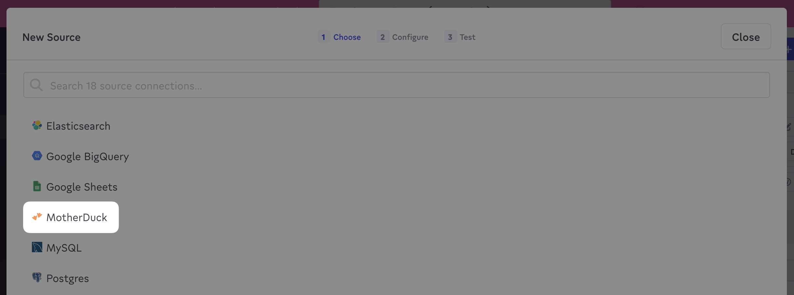
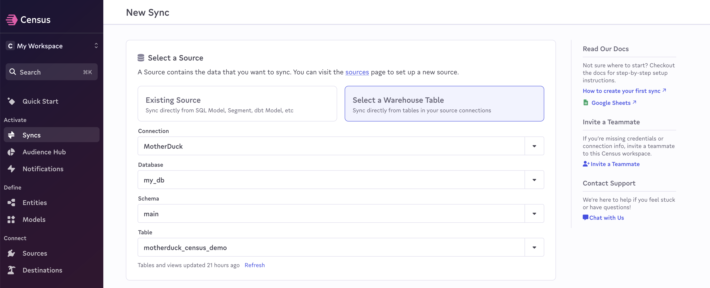

# MotherDuck

## Getting Started 

* If you haven’t already, [sign up for MotherDuck](https://motherduck.com/) and [start a free Census trial](https://app.getcensus.com/)
* Go to the MotherDuck UI and [copy your service token](https://motherduck.com/docs/authenticating-to-motherduck#authentication-using-a-service-token)
* Open Census and navigate to the **Sources** page
* Click **New Source** and select MotherDuck from the list:

<figure><figcaption>
Select the MotherDuck source.
</figcaption></figure>

* Enter your service token and click **Connect**
* You’re all set! Head over to the **Syncs** page to activate your data:

<figure><figcaption>
Create your first MotherDuck sync.
</figcaption></figure>

## Notes 

As of June 2023, MotherDuck only supports our [Basic Sync Engine](../overview.md#sync-engines).

## Need help connecting to MotherDuck?

Contact our support team or start a conversation with us via the [in-app](https://app.getcensus.com) chat.
